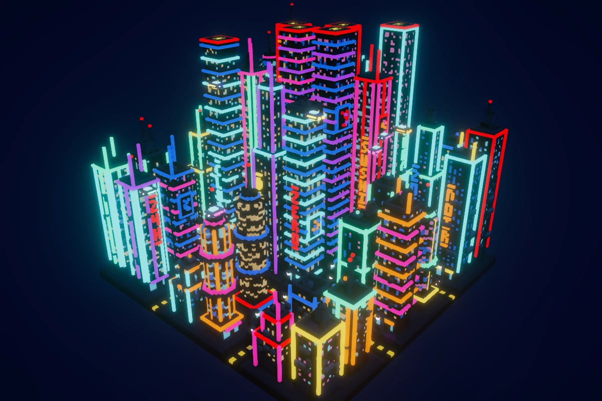
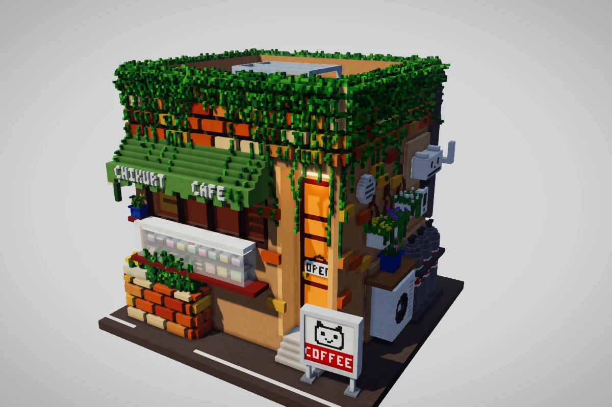
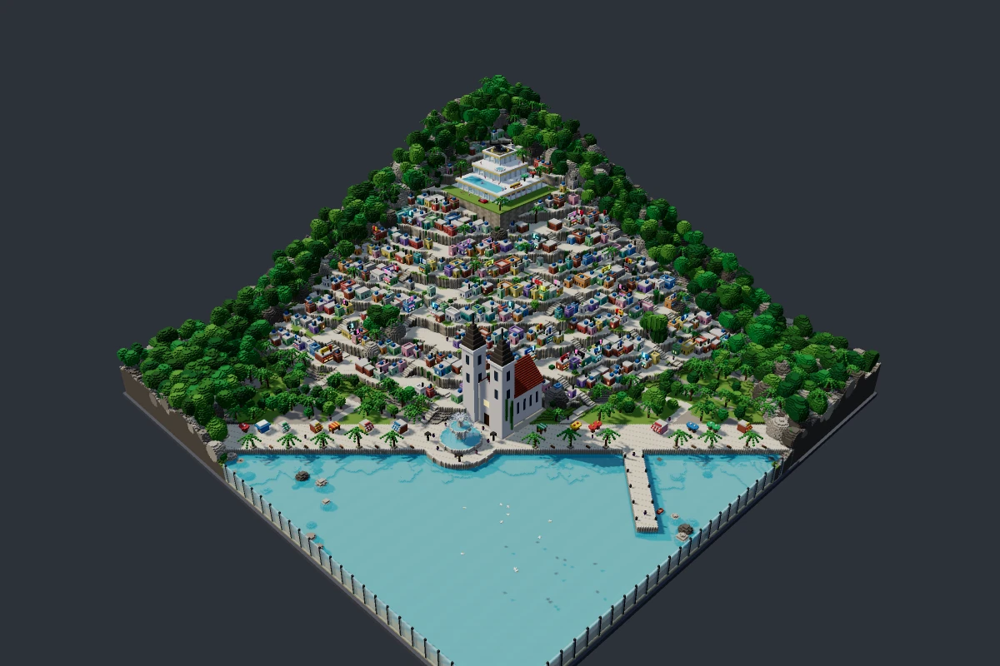
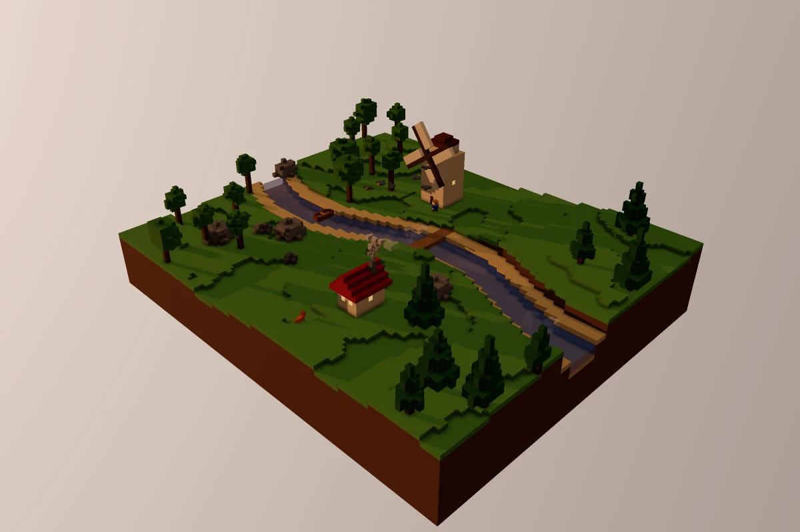
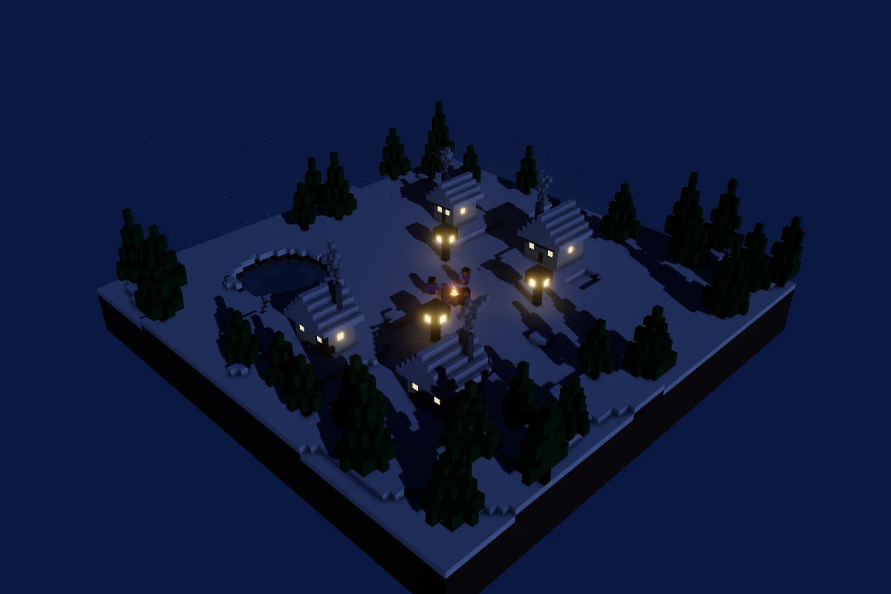
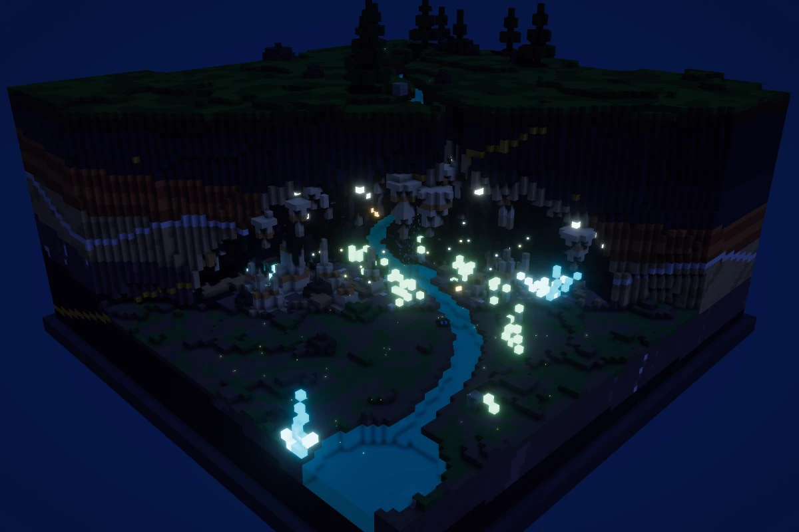

# Voxel Dioramas

### 👉 [**Open the gallery — brofrong.github.io/voxel-diorama**](https://brofrong.github.io/voxel-diorama/)

Tiny 3D worlds made of cubes, each one built by an AI agent from a short text prompt. Open any diorama in your browser, orbit around it, fly through it with <kbd>W</kbd><kbd>A</kbd><kbd>S</kbd><kbd>D</kbd>, scrub the time of day and watch the lights come on at night.

<table>
  <tr>
    <td><a href="https://brofrong.github.io/voxel-diorama/d/neon-city"></a></td>
    <td><a href="https://brofrong.github.io/voxel-diorama/d/cat-cafe"></a></td>
    <td><a href="https://brofrong.github.io/voxel-diorama/d/coastal-town"></a></td>
  </tr>
  <tr>
    <td align="center"><b>Neon City</b></td>
    <td align="center"><b>Cat Café</b></td>
    <td align="center"><b>Coastal Town</b></td>
  </tr>
  <tr>
    <td><a href="https://brofrong.github.io/voxel-diorama/d/river-mill"></a></td>
    <td><a href="https://brofrong.github.io/voxel-diorama/d/winter-night"></a></td>
    <td><a href="https://brofrong.github.io/voxel-diorama/d/glow-grotto"></a></td>
  </tr>
  <tr>
    <td align="center"><b>River Mill</b></td>
    <td align="center"><b>Winter Night</b></td>
    <td align="center"><b>Glow Grotto</b></td>
  </tr>
</table>

## Features

- **Real-time 3D in the browser** — Three.js with WebGPU (falls back to WebGL2), ambient occlusion, soft shadows, bloom on glowing blocks, tilt-shift depth of field and color grading.
- **Living scenes** — a full day–night cycle, particles (smoke, fire, fireflies, snow, rain, mist), point lights, and animated characters, animals, birds and vehicles.
- **Explore freely** — orbit and zoom with the mouse or touch, fly with <kbd>W</kbd><kbd>A</kbd><kbd>S</kbd><kbd>D</kbd> + <kbd>Space</kbd>/<kbd>Shift</kbd>, adjust flight speed, sky style and quality in the settings.
- **Every voxel has its own shade** — per-voxel color variation, noise-based brushes and ready-made prefabs (trees, pagodas, bridges, houses, people) let an agent produce rich, hand-crafted-looking scenes.
- **Deterministic and fast** — dioramas are plain TypeScript, baked into compact binary worlds at build time and meshed in Web Workers.

## Make your own diorama 🎨

**Contributions are welcome!** Every diorama on the site is a single folder of TypeScript code, written by an AI agent. You can add yours in a few steps:

1. **Fork and clone** the repository:

   ```sh
   git clone https://github.com/<your-username>/voxel-diorama.git
   cd voxel-diorama
   bun install
   bun run dev
   ```

2. **Ask your AI agent to build a diorama.** The repo ships with instructions for coding agents ([`CLAUDE.md`](CLAUDE.md) and the [`new-diorama`](.claude/skills/new-diorama/SKILL.md) skill), so a prompt like this is enough:

   > Create a new diorama: a floating island with a lighthouse, a stormy sea and seagulls circling above.

   The agent scaffolds `src/dioramas/<slug>/`, writes the scene with the SDK, validates it, reviews screenshots and saves a card thumbnail.

3. **Check it** — `bun run diorama:check <slug>` and `bun run check` must pass.

4. **Open a pull request.** Make sure `meta.author` names the model that built the diorama and `meta.launchedBy` links to *your* GitHub or social profile — both are shown on the gallery card.

Not into coding? **Open an [issue](https://github.com/brofrong/voxel-diorama/issues)** with your idea — diorama requests from users are welcome too.

## How it works

```
src/dioramas/<slug>/index.ts   ← a diorama: defineDiorama({ meta, size, build, entities, atmosphere })
src/sdk/                       ← the diorama API: world builder, brushes, prefabs, entities (no three.js)
src/engine/                    ← the 3D engine: meshing, rendering, atmosphere (no Svelte)
src/lib/, src/routes/          ← the SvelteKit site (fully prerendered)
```

A diorama describes its world with simple primitives (`box`, `sphere`, `blob`, `curve`, …), surface brushes (`grass`, `flowers`, `moss`, `vines`, …) and prefabs. At build time each world is baked into a compact `.vxb` file; the browser downloads it, meshes it in workers and renders it.

## Commands

| Command | What it does |
|---|---|
| `bun run dev` | Dev server with live reload of dioramas |
| `bun run diorama:new <slug> "Title"` | Scaffold a new diorama from the template |
| `bun run diorama:check [slug]` | Type-check, validate and bake a diorama, print stats and warnings |
| `bun run check` | Lint, type-check and run all tests |
| `bun run format` | Auto-format with Biome |
| `bun run build` | Bake all dioramas and build the static site |

## Tech stack

[Bun](https://bun.sh) · [SvelteKit](https://svelte.dev/docs/kit) + Svelte 5 · [Three.js](https://threejs.org) (WebGPU + TSL) · [Vite](https://vite.dev) · [Zod](https://zod.dev) · [Biome](https://biomejs.dev)

Every push to `main` is checked, built and deployed to GitHub Pages automatically.

## License

[MIT](LICENSE) © Brofrong — fork it, remix it, build your own gallery.
